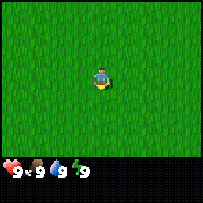

# Oneiro — a mini-DreamerV3 World Model for Crafter

A from-scratch reimplementation of [DreamerV3](https://arxiv.org/abs/2301.04104) (Hafner et al., 2023) in **JAX / Flax NNX**, trained on the [Crafter](https://github.com/danijar/crafter) benchmark (2D survival Minecraft, 22 hierarchical achievements, sparse rewards, 64×64 pixels).

> From **oneirology** — the scientific study of dreams (Greek *oneiros*). Fitting for an agent that learns its entire policy inside its own dreams: the imagination rollouts of its world model.

**15.26M parameters** (≈ DreamerV3-S class) — current best: **4.0 achievements/episode after only 64k env steps** (Rainbow baseline: 4.3 at 1M steps).



*Oneiro (v18 checkpoint, ~64k env steps) unlocking 5 achievements in one episode. The interesting part of this repo is less the score than the debugging journey — see below.*

## Why this repo might be useful to you

This project was built as a learning exercise: world model, RSSM, imagination-based actor-critic, all written from scratch, first in PyTorch then migrated to JAX. It went through **18+ documented training runs** to go from "worse than random" to "Rainbow-level in 64k steps", and every bug, hypothesis and fix is logged:

- **[docs/RUNS_BENCHMARK.md](docs/RUNS_BENCHMARK.md)** — full run-by-run chronology (v1 → v18): what changed, what happened, parameter-by-parameter impact analysis (in French)
- **[docs/HYPOTHESES.md](docs/HYPOTHESES.md)** — hypothesis registry: validated / invalidated / open, with evidence (in French)

Some of the bugs found along the way (all invisible to numerical parity tests):

| Bug | Symptom | Lesson |
|---|---|---|
| Recon loss `.mean()` instead of `.sum(pixels).mean()` | World model never learned | Loss scale is part of the paper's "system" |
| Missing `stop_gradient` on imagined states before the actor | Policy stayed random forever (PG drowned in straight-through noise) | Matches official `sg(imgfeat)` |
| Replay buffer interleaving 16 envs in flat storage | RSSM trained on fictitious cross-env "trajectories" — recon still converged, masking the bug | Multi-env buffers must sample single-env sequences |
| Free bits clamped per categorical (24 nats/step instead of 1) | KL pinned exactly at the floor → prior got no gradient | Sum factorized KL per step *before* clamping |
| Adaptive entropy α with Adam = sign-step on a scalar | Takeoff time = `ln(α_init/3e-4)/LR` iters, exactly | All reference impls use a fixed 3e-4 coefficient; adaptive α was a 3000-iter detour |
| Replay ratio 32 vs paper 512 | Policy committed to noise before the reward head had signal | World model must mature faster than the policy commits |

## Architecture

```
CNN encoder (64×64×3 → 192) ─┐
                             ├─ RSSM: GRU(384) + categorical z (24×24), unimix 1%
action one-hot ──────────────┘
        │
        ├─ CNN decoder (recon, sum-over-pixels MSE)
        ├─ Reward head  (twohot symlog, 255 bins, zero-init)
        ├─ Continue head
        │
Imagination (horizon 16, prior rollouts)
        ├─ Actor  (PG + fixed entropy 3e-4, percentile return normalization)
        └─ Critic (twohot, fast-critic λ-returns bootstrap, EMA slow critic as regularizer)
```

Key training details: KL balancing (β_dyn=0.5, β_rep=0.1), free bits 1 nat/step, symlog twohot returns, per-env GPU-resident replay buffer (uint8, JAX-resident, zero host↔device transfer in the hot loop), `jax.lax.scan` everywhere, functional train steps (`nnx.split`/`merge` outside `jit`).

## Project structure

```
crafter_dreamer/        # Main training code (Crafter, stage 3)
  scripts/train_dreamer_jax.py    # Training loop (JAX)
  scripts/modal_train_jax.py      # Modal cloud wrapper (L4 GPU)
  scripts/visualize_jax.py        # Rollout GIFs from checkpoints
  env/env.py                      # Crafter wrapper
src_jax/                # JAX/Flax NNX modules (encoder, decoder, RSSM, actor, critic, heads, RND)
  buffer.py             # Per-env GPU-resident replay buffer
src/                    # Original PyTorch implementation (reference)
docs/                   # Run benchmark + hypothesis registry
tests/                  # Numerical parity tests PyTorch ↔ JAX
```

## Quickstart

```bash
python -m venv .venv && source .venv/bin/activate
pip install -r requirements.txt

# Local smoke test (CPU, ~1 min)
python crafter_dreamer/scripts/train_dreamer_jax.py \
    --train_iter 3 --eval_interval 999 --n_envs 2 --batch_size 4 \
    --warmup_steps 200 --run_name smoketest --no_use_rnd
```

### Cloud training (Modal, L4 GPU ≈ $1.1/h)

```bash
pip install modal && modal setup

modal run --detach crafter_dreamer/scripts/modal_train_jax.py::main \
    --train-iter 4000 \
    --eval-interval 500 \
    --wm-train-per-iter 4 \
    --run-name my_run \
    --no-use-rnd
```

A 4000-iter run (~128k env steps) takes ≈ 1h and costs ≈ $1.3.

## Results

| Run | Config | Best (achievements/episode) | Env steps |
|---|---|---|---|
| v15 | + stop_gradient fix | 2.0 | 128k |
| v17 | + fixed entropy, per-env buffer, free-bits fix | 0.0 (premature collapse) | 64k |
| **v18** | **+ replay ratio ×4** | **4.0** (7/22 unlocked) | **64k** |

Reference points: random ≈ 1-2, Rainbow ≈ 4.3 @ 1M steps, DreamerV3-S target ≈ 5-7, DreamerV3-XL (200M) ≈ 11.7.

Work in progress: fast-critic bootstrap fix (v19) to stabilize the post-peak oscillations, then a full 1M-step run.

## References

- [DreamerV3 paper](https://arxiv.org/abs/2301.04104) — Hafner et al., 2023
- [danijar/dreamerv3](https://github.com/danijar/dreamerv3) — official implementation
- [danijar/crafter](https://github.com/danijar/crafter) — benchmark
- [symoon11/dreamerv3-flax](https://github.com/symoon11/dreamerv3-flax) — JAX/Flax reproduction (17.65 achievements)

## License

MIT
