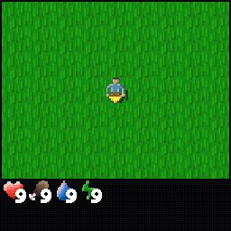

# Oneiro — a mini-DreamerV3 World Model for Crafter

A from-scratch reimplementation of [DreamerV3](https://arxiv.org/abs/2301.04104) (Hafner et al., 2023) in **JAX / Flax NNX**, trained on the [Crafter](https://github.com/danijar/crafter) benchmark (2D survival Minecraft, 22 hierarchical achievements, sparse rewards, 64×64 pixels).

> From **oneirology** — the scientific study of dreams (Greek *oneiros*). Fitting for an agent that learns its entire policy inside its own dreams: the imagination rollouts of its world model.

**Beats Rainbow and PPO on the official Crafter scoreboard, with 3× fewer parameters than DreamerV3.**



## Results

Crafter score at the standard **1M environment-step** budget (geometric mean of the 22 achievement success rates). Reference rows are the [official Crafter scoreboard](https://github.com/danijar/crafter#scoreboards).

| Method | Params | Score @1M |
|---|---|---|
| Human experts | — | 50.5% |
| Curious Replay | — | 19.4% |
| PPO (ResNet) | — | 15.6% |
| **DreamerV3** (official, `size200m`) | **~200M** | **14.5%** |
| DreamerV2 | — | 10.0% |
| **Oneiro** | **64.9M** | **8.2%** |
| **Oneiro** | **14.4M** | **5.2%** |
| PPO | — | 4.6% |
| Rainbow | — | 4.3% |
| Random *(measured here, 300 episodes)* | — | 1.51% |

Run past the benchmark budget, the 64.9M model reaches **10.05% / 10.56 achievements per episode** at 1.2M steps, with **19 of 22** achievements unlocked. The 14.4M model had **not converged** when its run ended — its final eval was its best.

> ⚠️ These are **single runs**. Two runs with identical config *and* identical seed diverged by 2.24 achievements at iteration 20000 (XLA reductions are not bit-deterministic, and the policy↔data loop is chaotic). Nothing here is multi-seed, so treat gaps under ~2 achievements as noise.

## The interesting part: one bug cost ~30 runs

The project sat at **2.2–2.5%** — barely above random — for about thirty documented training runs. Capacity, exploration, replay ratio, entropy schedules, reward weighting: none of it moved the needle. The cause turned out to be a **one-index temporal convention** in the reward head.

```python
buffer.add(obs_t, a_t, r_t)      # rewards[t] = r(obs_t, a_t)        "outgoing"
state_vec[t] ← obs_t + a_{t-1}   # the RSSM state never contains a_t
reward_head.loss(state_vec, rewards)   # predict r(obs_t, a_t) from a state without a_t
```

The target is **not a function of the input**. The Bayes-optimal predictor becomes `Σ_a π(a|s)·r(s,a)` — *the policy's own propensity*, a non-stationary quantity. Two consequences:

1. **The actor loses first-order credit.** In `A_t = r_t + γV(s_{t+1}) − V(s_t)`, the term `r_t` is constant with respect to the action being credited, so it cancels. The agent earns +1 for chopping wood, and that +1 cannot influence its decision to chop wood.
2. **A self-reinforcing lock-in.** The agent presses `do` on grass (saplings, 98% reliable) and rarely near trees → the reward head learns "grass pays, trees don't" → the value function devalues tree states → the policy avoids trees even more.

Measured on a checkpoint: in states where pressing `do` **would** yield wood, the policy ranked `do` **17th of 17 actions** (control group where `do` yields nothing: 3rd of 17). Credit assignment was not weak — it was **inverted**.

The fix is two halves of one convention — shift the training target by one index, and predict on the *arrival* state during imagination. Nothing else changed:

| | before | after |
|---|---|---|
| Crafter score | 2.22% | **10.05%** |
| `collect_wood` | 29% | **89%** |
| `place_table` | 0.9% | **78%** |
| `make_wood_pickaxe` | 0.02% | **42%** |
| `collect_stone` | **0** *(0 in 54 208 episodes)* | **25%** |
| rank of `do` when it pays | 17/17 | **1/17** |

Full chronology and evidence: **[docs/HYPOTHESES.md](docs/HYPOTHESES.md)** (hypothesis registry — validated / invalidated / open) and **[docs/HYPERPARAMS_COMPARISON.md](docs/HYPERPARAMS_COMPARISON.md)** (line-by-line diff against the official implementation). Both in French.

### Other bugs found along the way

All of these were invisible to numerical parity tests against the PyTorch reference — because the PyTorch reference had them too.

| Bug | Symptom | Lesson |
|---|---|---|
| Reward predicted from a state that lacks the action | Plateau at random level for ~30 runs | The target must be a function of the input |
| Recon loss `.mean()` instead of `.sum(pixels).mean()` | World model never learned | Loss scale is part of the paper's "system" |
| Missing `stop_gradient` on imagined states before the actor | Policy stayed random forever | Matches official `sg(imgfeat)` |
| Replay buffer interleaving 16 envs in flat storage | RSSM trained on fictitious cross-env trajectories — recon still converged, masking it | Multi-env buffers must sample single-env sequences |
| Free bits clamped per categorical (24 nats/step instead of 1) | KL pinned at the floor → prior got no gradient | Sum the factorized KL per step *before* clamping |
| Adaptive entropy α with Adam = sign-step on a scalar | Takeoff time = `ln(α_init/3e-4)/LR` iters, exactly | Every reference impl uses a fixed 3e-4 coefficient |

## Measurement traps worth knowing

These cost more time than the bugs did.

- **`crafter_score` is cumulative from step 0** — it can never go down, so it is useless as a live progress signal. Compare at a fixed step budget only.
- **Eval success rates are integer percentages over 75 episodes** — any event below ~1% reads as exactly 0. `make_wood_pickaxe` looked like "0 in 28 runs"; the training counters showed 31 occurrences in 54 208 episodes.
- **"Best-so-far vs last point"** on a sparsely sampled eval curve manufactures a fake "peak then decay" in ~54% of stopping points. A permutation test over 18 runs rejected the decay hypothesis at p = 0.015.
- **In-sample diagnostics lie.** The reward-head metric was computed on the very batch being fitted; out of sample, two configs that read 0.80 and 0.58 both scored 0.40.

## Architecture

```
CNN encoder (64×64×3) ──┐
                        ├─ RSSM: GRU(deter) + categorical z, unimix 1%
prev action one-hot ────┘
        │
        ├─ CNN decoder      (sum-over-pixels MSE, linear output +0.5)
        ├─ Reward head      (twohot symlog, 255 bins, zero-init, incoming convention)
        ├─ Continue head
        │
Imagination (horizon 16, prior rollouts)
        ├─ Actor   (PG + fixed entropy 3e-4, percentile return normalization)
        └─ Critic  (twohot, λ-returns, EMA slow critic as regularizer)
```

| | embed | deter | z | hidden | cnn depth | actor/critic | total |
|---|---|---|---|---|---|---|---|
| large | 1024 | 2048 | 32×32 | 1024 | 32 | 1024×3 | **64.9M** |
| small | 512 | 1280 | 32×16 | 256 | 16 | 256×2 | **14.4M** |

The small config is nearly danijar's `size12m` preset (identical `hidden`, `classes`, `depth` and `units`; only `deter` differs: 1280 vs 2048).

Training details: KL balancing (β_dyn=0.5, β_rep=0.1), free bits 1 nat/step summed over categories, symlog twohot returns, per-env replay buffer (uint8, GPU- or host-resident), `jax.lax.scan` everywhere, functional train steps (`nnx.split`/`merge` outside `jit`), GSPMD data-parallel across TPU cores.

## Project structure

```
crafter_dreamer/
  scripts/train_dreamer_jax.py    # training loop — single entry point
  scripts/kaggle_train.py         # Kaggle TPU launcher (launch / status / pull)
  scripts/visualize_jax.py        # rollout GIFs from a checkpoint
  scripts/test_*.py               # PyTorch↔JAX parity checks (need torch)
  env/env.py                      # Crafter wrapper
src_jax/                          # JAX/Flax NNX modules
  model/                          # encoder, decoder, rssm, actor, critic, heads, rnd
  buffer.py                       # per-env replay buffer (GPU- and host-resident variants)
src/                              # original PyTorch implementation (reference for parity tests)
experiments/
  credit_assignment_probe.py      # offline credit-assignment diagnostic (see below)
  parse_logs.py                   # run summaries/logs → CSV
  plot_runs.py                    # learning curves, internals, achievement heatmaps
docs/                             # hypothesis registry + hyperparameter diff vs the paper
```

## Quickstart

```bash
python -m venv .venv && source .venv/bin/activate
pip install -r requirements.txt

# Local smoke test (CPU, ~1 min).
# --buffer_capacity is required: the default is 1M transitions ≈ 12.3 GB.
JAX_PLATFORMS=cpu python crafter_dreamer/scripts/train_dreamer_jax.py \
    --train_iter 3 --eval_interval 999 --n_envs 2 --batch_size 4 \
    --warmup_steps 200 --buffer_capacity 20000 \
    --run_name smoketest --no_use_rnd
```

The full architecture is exposed on the CLI (`--h_dim`, `--cnn_depth`, `--z_categories`, …), so capacity experiments need no code edit.

### Cloud training (Kaggle TPU v5e-8, free tier)

Requires a Kaggle account and an API token in `KAGGLE_API_TOKEN`.

```bash
python crafter_dreamer/scripts/kaggle_train.py launch \
    --run-name my-run --tpu \
    --train-iter 30000 --eval-interval 2500 \
    --wm-train-per-iter 4 --n-envs 4 --batch-size 16 \
    --buffer-device cpu --buffer-capacity 1000000 \
    --extra-args "--ac_train_per_iter 4 --rare_weight 1.0 --seed 42"

python crafter_dreamer/scripts/kaggle_train.py status --run-name my-run
python crafter_dreamer/scripts/kaggle_train.py pull   --run-name my-run
```

The launcher clones the branch from GitHub, so **push before launching**. A 30k-iteration run (≈1M env steps) takes about 7 h on a TPU v5e-8, which is where the score peaks — beyond that the curve flattens. Kaggle allows one TPU session at a time.

### Diagnosing credit assignment without a training run

The metric that found the bug above. It rolls the policy out in the real environment, forks the env at each step to label whether `do` would yield wood, then ranks all 17 actions in each state. ~2 minutes on CPU.

```bash
JAX_PLATFORMS=cpu python experiments/credit_assignment_probe.py \
    --checkpoint path/to/checkpoint.npz
```

```
[+] do pays off        rank of 'do' by π :  1.0/17   #1 in 76% of cases
[-] control            rank of 'do' by π :  3.0/17   #1 in 29% of cases
VERDICT : healthy credit
```

A rank near 9/17 means the signal is uninformative; a rank *worse* than the control means it is inverted.

### Figures

```bash
python experiments/parse_logs.py --summaries   # run summaries → CSV
python experiments/plot_runs.py                # curves, internals, heatmaps
```

## References

- [DreamerV3 paper](https://arxiv.org/abs/2301.04104) — Hafner et al., 2023
- [danijar/dreamerv3](https://github.com/danijar/dreamerv3) — official implementation
- [danijar/crafter](https://github.com/danijar/crafter) — benchmark and scoreboard
- [symoon11/dreamerv3-flax](https://github.com/symoon11/dreamerv3-flax) — JAX/Flax reproduction, 17.65% Crafter score (world model ~181M params)

## License

MIT
